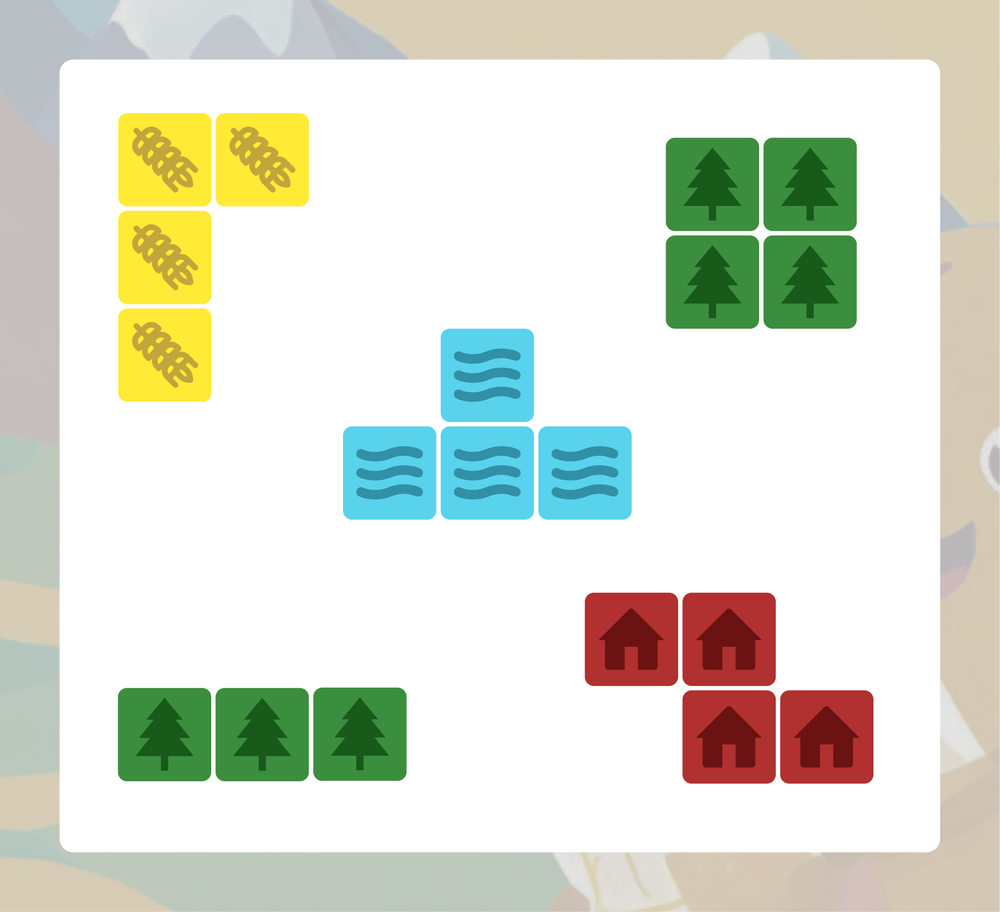
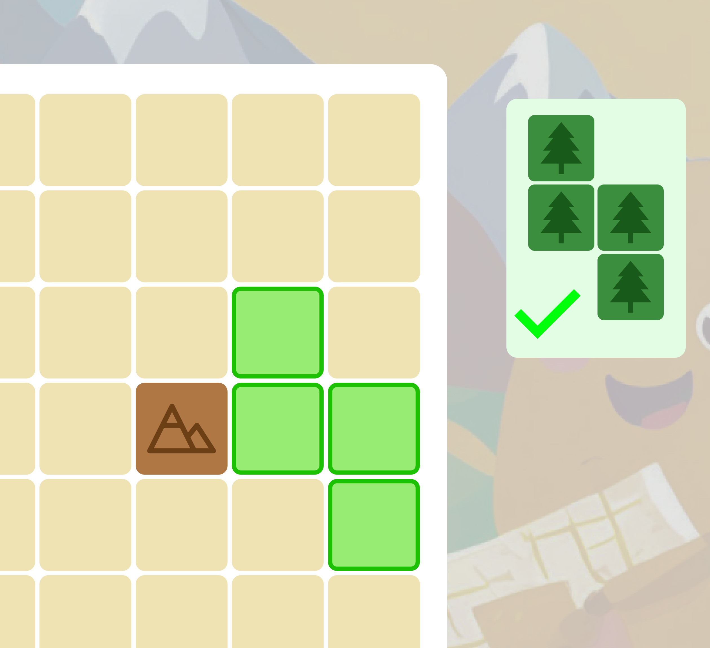
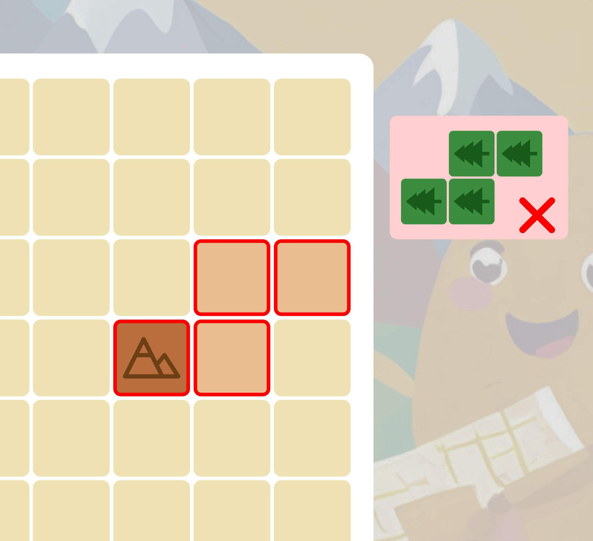
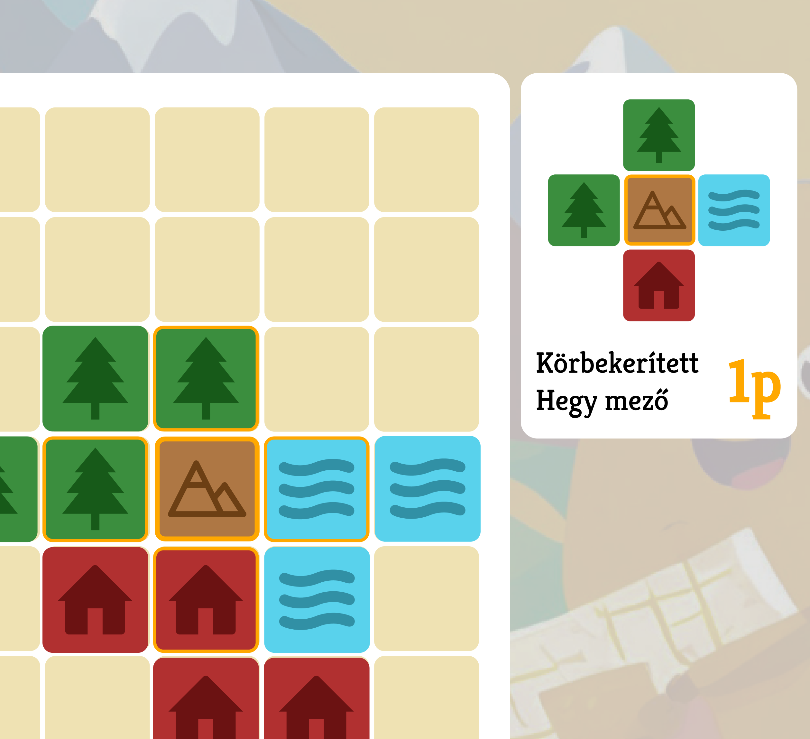

# A Térképész Játék

## Rövid áttekintés

Ebben az egyszemélyes játékban egy **11x11-es négyzetrácsos térképre** kell lehelyezni különböző alakzatú, különböző tereptípusú térképelemeket. Minden elemhez tartozik egy időérték (**1 vagy 2**), és a játék **28 időegységből** áll. A játék végén (vagy közben) a négyzetrács aktuális állapota alapján kell pár ellenőrzést (**küldetést**) elvégezni, és ezek alapján alakul ki a végső pontszám.

---

## A térkép kiindulási állapota

A térkép egy **11x11-es négyzetrács**, kezdetben üres cellákkal feltöltve. A térképen **5 fix cellában hegymezők találhatóak**. A hegyek a térkép alábbi mezőiben helyezkednek el:

- (2,2)
- (4,9)
- (6,4)
- (9,10)
- (10,6)

---

## Térképelemek lehelyezése

A letehető térképelemek tereptípusai:

- **Erdő**
- **Falu**
- **Farm**
- **Víz**

Az összes lehetséges elem meg van adva egy JavaScript tömbben, ezek közül néhány így néz ki:

A lehetséges elemeket **véletlenszerűen megkeverjük**, majd sorban egymás után egyesével kell őket lehelyezni a térképre. Minden térképelem **forgatható és tükrözhető**, de **nem fedhet le már teli mezőt** (a hegy is ennek számít), illetve **nem lóghat le a térképről**.

### Példák:

#### ✅ Jól lehelyezett elem:

#### ❌ Rosszul lehelyezett elem:

---

## A játék időtartama

A játék **28 időegységig** tart. Minden térképelemhez tartozik egy **időérték** (1 vagy 2), ami meghatározza, hogy mennyi ideig tart őket felfedezni. Addig tudunk új térképelemeket húzni, amíg el nem érjük a **28 időegységet**.

📌 **Példa:** Ha **1 időegység** maradt hátra, és egy **2 időegységgel rendelkező térképelemet** kapunk, azt még lehelyezhetjük, de utána a játék véget ér.

---

## Pontszámítás

Minden játék elején ki kell választani **4 véletlenszerű küldetéskártyát** (**A, B, C, D**), amik alapján pontot lehet szerezni.

Például:

> "A hegymezőiddel szomszédos vízmezőidért három-három pontot kapsz."

Ha a **hegyeket 4 oldalról körbevesszük**, körbevett hegyenként **1-1 pontot kapunk**.

A játék végén meg kell számolni mindegyik küldetés alapján kapott pontokat, és ezek összesített eredménye lesz a végleges pontszám.

---

## Évszakok

A **28 időegységet** négy évszakra lehet bontani, minden évszak végén pontozás történik. Az évszakok segítenek a stratégia kialakításában.

🎯 **Cél:** Minél magasabb pontszám elérése az adott küldetések teljesítésével!

---

## Készítette

👨‍💻 **Adam Risztics**
